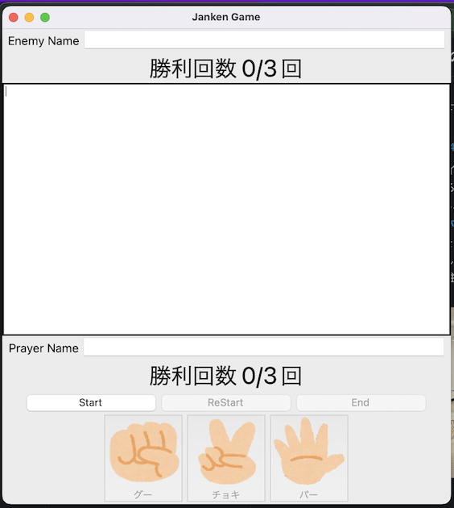

# じゃんけんゲーム

## 内容

プレイヤーとエネミーどちらかのHPが0以下になるまでじゃんけんをする

## 環境

| 項目名 | バージョン |
|:--: | :-- |
| Python | 3.10 |

## 環境構築

### Mac

```terminal
# python、itのインストール
brew install python git
// pyenvのインストール
pip install pipenv
```

### Windows

```PowerShellプロンプト
// scoopのインストールをする
Set-ExecutionPolicy RemoteSigned -scope CurrentUser
invoke-Expression (New-Object System.Net.WebClient).DownloadString('https://get.scoop.sh')

// python、git（入れてない場合)のインストール
scoop install git python-3.10
```

### 共通

```terminal

# githubからクローン（ソースの取得）する
git clone https://github.com/yuki-ono-vlb/JankenGame.git
git gc
git pull

# 必要なライブラリのインストールを行う
pipenv install
# 開発時のみ使用するライブラリのインストールを行う
pipenv install --dev
```

## ゲームの起動方法(共通)

```terminal

# ソースのプロジェクトへ移動
cd JankenGame

python ./src/main.py

// または
pipenv run start
```

*もし、mac環境でゲームが起動しないなどの問題が発生した場合は以下の記事を読んでください。  
[Macのpyenv環境でTkinterが使えない時の対処法](https://qiita.com/lberc_yuki_ono/items/11f001a55a14fcde08a1)

## 遊び方



1. エネミーとプレイヤーの名前を入力する
2. Startボタンを押す
3. グー、チョキ、パーのボタンの何れかを押す
4. じゃんけんで勝つと勝利回数が増えていく
5. じゃんけんで負けるとエネミーの勝利回数が増えていく
6. 繰り返しじゃんけんをしてに先に3回勝利した方の勝ち
7. じゃんけんの途中で遣り直しを行いたい場合はReStartボタンを押す
8. じゃんけんを終了したい場合はEndボタンを押す
